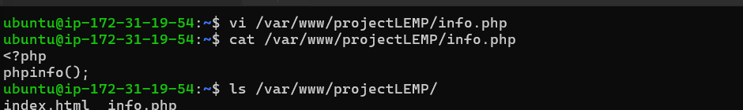

# Deploying a Web Solution using LEMP STACKS

## Introduction

The LEMP software stack is a group of software that can be used to serve dynamic web pages and web applications written in PHP. This is an acronym that describes a Linux operating system, with an Nginx (pronounced like “Engine-X”) web server. The backend data is stored in the MySQL database and the dynamic processing is handled by PHP.

**This guide demonstrates how to install a LEMP stack on an Ubuntu 20.04 server using EC2**

## Step 0

1. EC2 Instance of t2.micro type and Ubuntu 24.04 LTS (HVM) was lunched in the us-east-1 region using the AWS console


<br><br>

2. The security group was configured with the following inbound rules:

- Allow traffic on port 80 (HTTP) with source from anywhere on the internet.
- Allow traffic on port 443 (HTTPS) with source from anywhere on the internet.
- Allow traffic on port 22 (SSH) with source from any IP address. This is opened by default.
<br><br>

3. Let's Connect our instance using SSH, then `cd` into the folder where the `private-key` was downloaded then ssh into it

<br><br>

```bash
cd desktop

chmod 400 steghub.pem

ssh -i "steghub.pem" ubuntu@ec2-34-227-7-216.compute-1.amazonaws.com
```

<br>

<br><br>

## Step 1 - Install Nginx Web Server

1. Update and upgrade list of packages in package manager

```bash
sudo apt update
sudo apt upgrade -y
```

<br><br>

2. Run Nginx

```bash
sudo apt install nginx
```

<br><br>

3. Enable and verify that apache is running on as a service on the OS.

```bash
sudo systemctl enable nginx
sudo systemctl status nginx
```

<br><br>

4. The server is running and can be accessed locally in the ubuntu shell by running the command below:

```bash
curl http://localhost:80
OR
curl http://127.0.0.1:80
```

<br><br>

5. Test with the public IP address if the Apache HTTP server can respond to request from the internet using the url on a browser.

```bash
http://54.163.52.193:80
```

<br><br>

6. Another way to retrieve your public ip address, other than to check it in AWS web console, is to use

```bash
curl -s  http://169.254.169.254/latest/meta-data/public-ipv4
```

<br><br>

## Step 2 - Install MySQL

1. Install a relational database (RDB)

MySQL was installed in this project. It is a popular relational database management system used within PHP environments.

```bash
sudo apt install mysql-server
```

<br><br>

_When prompted, install was confirmed by typing y and then Enter._

2. Enable and verify that mysql is running with the commands below

```bash
sudo systemctl enable --now mysql
sudo systemctl status mysql
```


3. Log in to mysql console

```bash
sudo mysql
```

This connects to the MySQL server as the administrative database user root infered by the use of sudo when running the command.


4. Set a password for root user using mysql_native_password as default authentication method.

Here, the user's password was defined as "Pswd@@"

```bash
ALTER USER 'root'@'localhost' IDENTIFIED WITH mysql_native_password BY 'Pswd@@';
```

<br><br>

Exit the MySQL shell

```bash
exit
```

## Step 3 - Install PHP

1. Install php Apache is installed to serve the content and MySQL is installed to store and manage data. PHP is the component of the set up that processes code to display dynamic content to the end user.

The following were installed:

- php package
- php-mysql, a PHP module that allows PHP to communicate with MySQL-based databases.
- libapache2-mod-php, to enable Apache to handle PHP files.

```bash
sudo apt install php libapache2-mod-php php-mysql
```

<br><br>

Confirm the PHP version

```bash
php -v
```

**At this ponit, the LEMP stack is completely installed and fully operational.**

To tset the set up with a PHP script, it's best to set up a proper Apache Virtual Host to hold the website files and folders. Virtual host allows to have multiple websites located on a single machine and it won't be noticed by the website users.

## Step 4 - Create a virtual host for the website using Apache

1. The default directory serving the apache default page is /var/www/html. Create your document directory next to the default one.

Created the directory for projectlamp using `mkdir` command

```bash
sudo mkdir /var/www/projectLEMP
```

Assign the directory ownership with $USER environment variable which references the current system user.

```bash
sudo chown -R $USER:$USER /var/www/projectLEMP  
```

2. Create and open a new configuration file in nginx’s “sites-available” directory using nano.

```bash
sudo nano /etc/nginx/sites-available/projectLEMP
```

_To `Save` use `ctrl + x` and then press `y` then `enter`_


Paste in the bare-bones configuration below:

```bash
# /etc/nginx/sites-available/projectLEMP
server {
    listen 80;
    server_name projectLEMP www.projectLEMP;
    root /var/www/projectLEMP;

    index index.html index.htm index.php;

    location / {
        try_files $uri $uri/ =404;
    }

    location ~ \.php$ {
        include snippets/fastcgi-php.conf;
        fastcgi_pass unix:/var/run/php/php7.4-fpm.sock;
     }

    location ~ /\.ht {
        deny all;
    }

}
```


3. Activate your configuration by linking to the config file from Nginx’s sites-enabled directory:

```bash
sudo ln -s /etc/nginx/sites-available/your_domain /etc/nginx/sites-enabled/
```

4. Then, unlink the default configuration file from the /sites-enabled/ directory:

```bash
sudo unlink /etc/nginx/sites-enabled/default
```

This will tell Nginx to use the configuration next time it is reloaded.

5. You can test your configuration for syntax errors by typing:

```bash
sudo nginx -t
```

If any errors are reported, go back to your configuration file to review its contents before continuing.


6. When you are ready, reload Nginx to apply the changes:

```bash
sudo systemctl reload nginx
```

Your new website is now active, but the web root /var/www/projectLEMP is still empty. Create an index.html file in that location so that we can test that your new server block works as expected:

```bash
sudo echo 'Hello LEMP from hostname' $(curl -s http://169.254.169.254/latest/meta-data/public-hostname) 'with public IP' $(curl -s http://169.254.169.254/latest/meta-data/public-ipv4) > /var/wwww/projectLEMP/index.html
```

7. Now go to your browser and access your server’s domain name or IP address, as listed within the server_name directive in your server block configuration file:

```bash
http://204.236.192.94
```


_Your LEMP stack is now fully configured. In the next step, we’ll create a PHP script to test that Nginx is in fact able to handle .php files within your newly configured website._

## Step 5 –Testing PHP with Nginx

Your LEMP stack should now be completely set up. You can test it to validate that Nginx can correctly hand .php files off to your PHP processor.

You can do this by creating a test PHP file in your document root.

1. Open a new file called info.php within your document root in your text editor:

```bash
vi /var/www/projectLEMP/info.php
```

Type or paste the following lines into the new file. This is valid PHP code that will return information about your server:

```bash
<?php
phpinfo();
```



2. You can now access this page in your web browser by visiting the domain name or public IP address you’ve set up in your Nginx configuration file, followed by /info.php:

```bash
http://204.236.192.94/info.php
or 
serverdomain/info.php
```


After checking the relevant information about your PHP server through that page, it’s best to remove the file you created as it contains sensitive information about your PHP environment and your Ubuntu server. You can use rm to remove that file:

```bash
sudo rm /var/www/projectLEMP/info.php
```


## Step 6 — Retrieving data from MySQL database with PHP

1. First, connect to the MySQL console using the root account:

```bash
sudo mysql -u root -p
```


2. To create a new database, run the following command from your MySQL console:

```bash
mysql> CREATE DATABASE steghub_DB;
```


3. The following command creates a new user named example_user, using mysql_native_password as default authentication method. We’re defining this user’s password as password, but you should replace this value with a secure password of your own choosing.

```bash
mysql> CREATE USER 'eddy'@'%' IDENTIFIED WITH mysql_native_password BY 'Pswd@@1'

mysql> GRANT ALL ON steghub_DB.* TO 'eddy'@'%';
```


4. Now exit the MySQL shell with:

```bash
mysql> exit
```

5. You can test if the new user has the proper permissions by logging in to the MySQL console again, this time using the custom user credentials:

```bash
mysql -u eddy -p
```


6. Confirm that you have access to the example_database database:

```bash
mysql> SHOW DATABASES;
```


7. We’ll create a test table named todo_list. From the MySQL console, run the following statement:

```bash
mysql> CREATE TABLE steghub_DB.todo_list (
mysql> item_id INT AUTO_INCREMENT,
mysql> content VARCHAR(255),
mysql> PRIMARY KEY(item_id)
);
```


8. Insert a few rows of content in the test table. You might want to repeat the next command a few times, using different values:

```bash
mysql> INSERT INTO steghub.todo_list (content) VALUES ("My first important item");
mysql> INSERT INTO steghub.todo_list (content) VALUES ("My second important item");
mysql> INSERT INTO steghub.todo_list (content) VALUES ("My third important item");
mysql> INSERT INTO steghub.todo_list (content) VALUES ("and this one more thing");
```


9. To confirm that the data was successfully saved to your table, run:

```bash
mysql> SELECT * FROM steghub_DB.todo_list;
```

```bash
Output
+---------+--------------------------+
| item_id | content                  |
+---------+--------------------------+
|       1 | My first important item  |
|       2 | My second important item |
|       3 | My third important item  |
|       4 | and this one more thing  |
+---------+--------------------------+
4 rows in set (0.000 sec)

```

10. After confirming that you have valid data in your test table, you can exit the MySQL console:

```bash
mysql> exit
```

Now you can create the PHP script that will connect to MySQL and query for your content.

11. Create a new PHP file in your custom web root directory using your preferred editor. We’ll use nano for that:

```bash
nano /var/www/projectLEMP/todo_list.php
```

The following PHP script connects to the MySQL database and queries for the content of the todo_list table, exhibiting the results in a list. If there’s a problem with the database connection, it will throw an exception.

12. Copy this content into your todo_list.php script:

```bash
<?php
$user = "example_user";
$password = "password";
$database = "example_database";
$table = "todo_list";

try {
  $db = new PDO("mysql:host=localhost;dbname=$database", $user, $password);
  echo "<h2>TODO</h2><ol>"; 
  foreach($db->query("SELECT content FROM $table") as $row) {
    echo "<li>" . $row['content'] . "</li>";
  }
  echo "</ol>";
} catch (PDOException $e) {
    print "Error!: " . $e->getMessage() . "<br/>";
    die();
}
```

_Save and close the file when you’re done editing._

You can now access this page in your web browser by visiting the domain name or public IP address configured for your website, followed by /todo_list.php:

```bash
http://204.236.192.94/todo_list.php
```


### That means your PHP environment is ready to connect and interact with your MySQL server

## Conclusion

We’ve built a flexible foundation for serving PHP websites and applications to your visitors, using Nginx as web server and MySQL as database system.<br><br>

# Thank You
